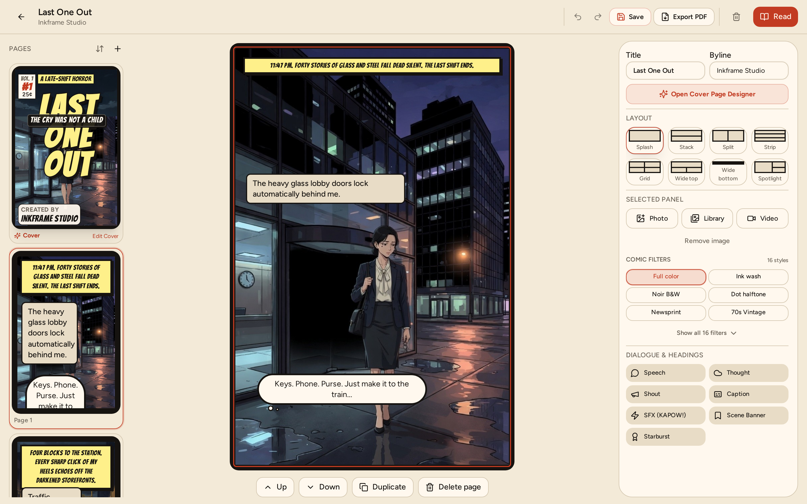
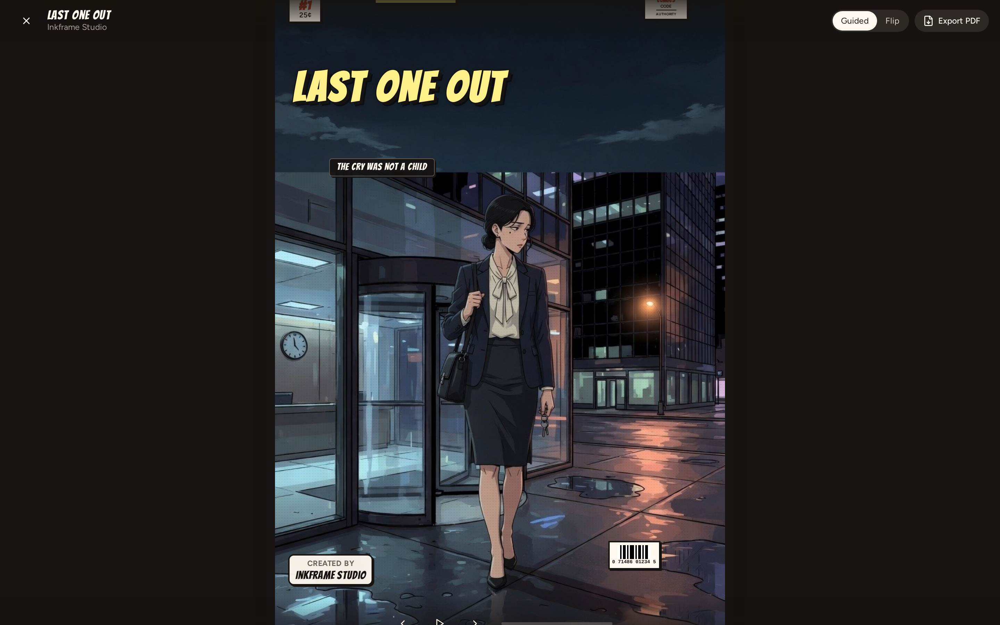
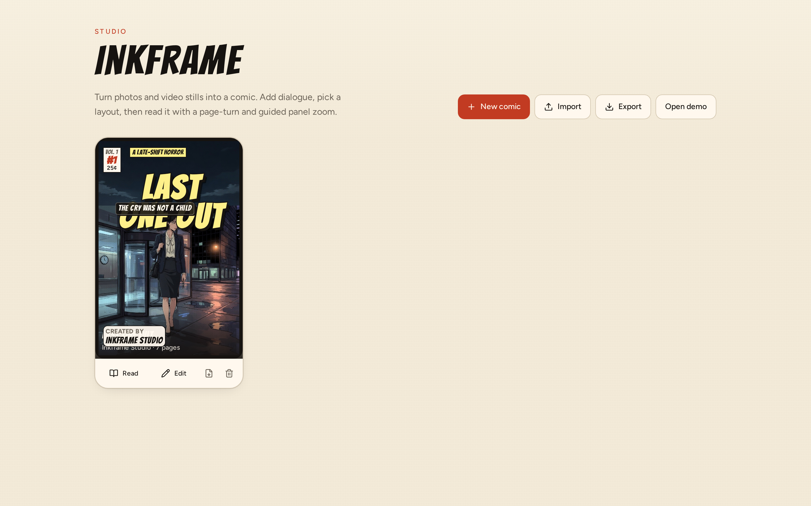
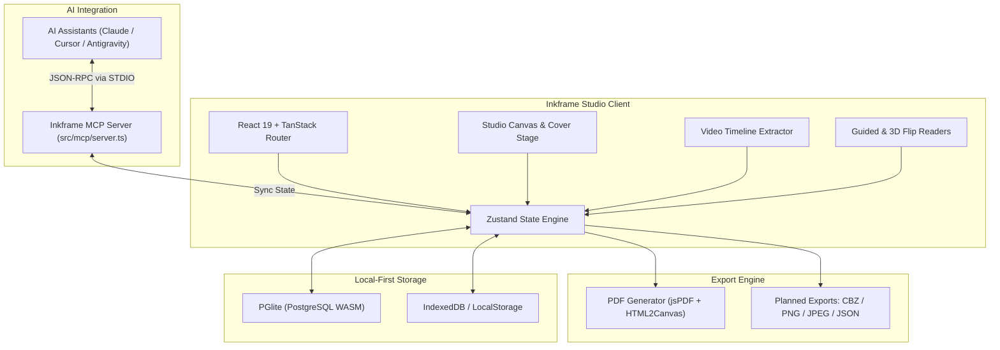

# Inkframe

**Inkframe** is an open hobby project created to make comic creation easy, intuitive, and seamlessly connected with AI through the Model Context Protocol (MCP).

It serves as a local-first web application and AI-assisted studio that turns photos, illustrations, and video stills into structured graphic novels, comics, and visual storyboards.

## Interface Showcase

| Studio Canvas & Panel Editor | Immersive Comic Reader |
| :---: | :---: |
|  |  |

| Project Library & Workspace Gallery |
| :---: |
|  |

---

## About & Vision

Inkframe started as a personal passion project with a simple goal: to lower the barrier to comic creation and experiment with AI-driven narrative tools. 

By integrating a native **Model Context Protocol (MCP) server**, Inkframe allows AI assistants (like Claude, Cursor, and Antigravity) to act as creative partners—manipulating panel layouts, inserting dialogue, and generating panel prompts directly inside your workspace.

### Core Goals & Future Roadmap
- **Design & Layout Enhancements**: Continuously elevate canvas aesthetics, UI typography, dynamic panel grid systems, and custom speech bubble styling.
- **Expanded Creation Tools**: Introduce richer color grading, screentone generators, asset libraries, and character reference management.
- **Multi-Format Export Engine**: Move beyond PDF export to support:
  - **CBZ (Comic Book Zip)** archives for digital comic reader applications.
  - **High-Resolution Image Bundles** (PNG and JPEG exports per page or panel).
  - **Layout Interchange Format** (JSON import/export for sharing comic templates and drafts).

---

## Features

### 1. Studio Canvas & Panel Editor
- **Dynamic Layout Templates**: Standard layout presets including Splash, Stack, Split, Strip, Grid, Spotlight, and Wide Top/Bottom.
- **Drag & Drop Media Staging**: Direct drag-and-drop mapping of imported imagery onto panel slots.
- **Speech Bubble & Dialogue Engine**: Insert and style Speech, Thought, Shout, and Caption balloons with interactive tail placement controls.
- **Real-Time Visual Filters**: Authentic ink filters including Noir, Wash, Halftone, Newsprint, and Screentone.

### 2. Cover Designer & Branding
- **Custom Comic Covers**: Control over issue titles, subtitles, issue numbering, taglines, publisher branding, and pricing overlays.
- **Live Visual Preview**: High-DPI preview stage for cover layout templates and styling.

### 3. Video Frame Capture & Extraction
- **Timeline Scrubbing**: Scrub through custom video uploads or demo media to select exact freeze-frames.
- **Automated Interval Sampling**: Automatically extract video frames at defined time intervals (e.g., 1 frame every 5s, 10s, or 15s).

### 4. Model Context Protocol (MCP) Server
- **AI-Driven Authoring**: Built-in MCP server enabling AI models to inspect project states, add pages, update covers, and inject dialogue.
- **Tool Suite**: Standardized tool interface covering page generation, filter applications, prompt engineering, and character context setting.

### 5. Reader Modes & Export
- **Guided Focus Reader**: Sequential panel-by-panel reading experience with smooth focus zoom and pan transitions.
- **3D Flipbook Reader**: Interactive 3D page-turning presentation for full-page comic reading.
- **Multi-Format Export**: PDF export with upcoming support for CBZ, PNG/JPEG image packages, and JSON template schemas.

### 6. Local-First Storage
- **Browser Persistence**: Powered by PGlite (PostgreSQL compiled to WebAssembly), IndexedDB, and localStorage fallback.
- **Page Management**: Sidebar thumbnail drag-and-drop page reordering.
- **Bundled Sample Comic**: Pre-loaded with the demo graphic novel *"Last One Out"*.

---

## Architecture Overview



---

## Tech Stack

| Component | Technology | Role |
| :--- | :--- | :--- |
| **Framework** | React 19 | Client rendering library |
| **Routing** | TanStack Router & TanStack Start | Type-safe file-based routing |
| **Build & Server** | Vite 8 & Nitro | Development server and bundler engine |
| **Styling** | Tailwind CSS v4 & tw-animate-css | CSS framework and animations |
| **UI Components** | Radix UI & Lucide Icons | Accessible headless components and UI icons |
| **State Management** | Zustand 5 | Central state management store |
| **Database & Auth** | PGlite & Better Auth | WASM PostgreSQL browser database |
| **AI Protocol** | @modelcontextprotocol/sdk | Model Context Protocol API layer |
| **Export Engines** | jsPDF & HTML2Canvas | PDF rendering and canvas capture |

---

## Quick Start

### 1. Prerequisites

Node.js 18.0.0 or higher is required.

```bash
node -v
```

### 2. Installation

Clone the repository and install project dependencies:

```bash
git clone https://github.com/AjiMk/inkframe.git
cd inkframe
npm install
```

### 3. Development Server

Start the local development server:

```bash
npm run dev
```

The application will be accessible at `http://localhost:8080`.

---

## NPM Scripts Reference

| Script | Command | Description |
| :--- | :--- | :--- |
| `dev` | `npm run dev` | Starts Vite development server at `http://0.0.0.0:8080` |
| `build` | `npm run build` | Builds production bundle and executes database migrations |
| `build:dev` | `npm run build:dev` | Builds bundle in development mode |
| `preview` | `npm run preview` | Previews the production build locally |
| `preview:restart` | `npm run preview:restart` | Restarts the background preview process |
| `preview:stop` | `npm run preview:stop` | Stops the background preview process |
| `typecheck` | `npm run typecheck` | Executes TypeScript type checking (`tsc --noEmit`) |
| `mcp` | `npm run mcp` | Launches the Model Context Protocol stdio server |
| `test` | `npm run test` | Runs internal test suites |
| `lint` | `npm run lint` | Runs ESLint across the workspace |
| `format` | `npm run format` | Runs Prettier to format source files |
| `check:auth` | `npm run check:auth` | Checks authentication invariants |

---

## Model Context Protocol (MCP) Integration

To connect Inkframe with AI tools such as Claude Desktop, Cursor, or Antigravity, add the server definition to your client's `mcp.json`:

```json
{
  "mcpServers": {
    "inkframe": {
      "command": "npm",
      "args": ["run", "mcp"],
      "cwd": "/path/to/inkframe"
    }
  }
}
```

### MCP Tool Manifest

| Tool | Action | Details |
| :--- | :--- | :--- |
| `list_comics` | List Workspace Comics | Returns array of all comics in the current workspace. |
| `create_comic` | Create New Project | Instantiates a new comic with metadata (title, author). |
| `get_comic` | Get Comic Details | Returns complete comic object including pages, layouts, and dialogue. |
| `add_page` | Add Page | Appends a new page with a target panel layout. |
| `set_page_layout` | Change Layout | Updates layout template for a designated page. |
| `add_dialogue` | Inject Dialogue | Adds Speech, Thought, Shout, or Caption bubbles into a panel. |
| `update_cover_config` | Edit Cover Specs | Modifies title, subtitle, tagline, issue number, and price styling. |
| `apply_panel_filter` | Apply Visual FX | Sets filters (Noir, Wash, Halftone, Newsprint) for a panel. |
| `set_comic_references` | Set Reference Context | Sets character and background image references for AI continuity. |
| `get_panel_prompt` | Prompt Engineering | Constructs detailed AI image generation prompts for panel scenes. |

---

## Project Structure

```
inkframe/
├── public/                 # Static assets and demo media
│   ├── favicon.svg
│   └── mcp_comics.json     # MCP dataset state sync file
├── scripts/                # Utility and migration scripts
├── server/                 # Server handlers and API routes
├── src/
│   ├── components/
│   │   ├── comic/          # Studio canvas, cover designer, reader, video timeline
│   │   └── ui/             # Radix UI styled primitives
│   ├── lib/
│   │   ├── app-data/       # IndexedDB and demo dataset loaders
│   │   ├── auth/           # Authentication handlers
│   │   └── comics/         # Stores, layout definitions, and export logic
│   ├── mcp/
│   │   └── server.ts       # Model Context Protocol stdio implementation
│   └── routes/             # TanStack file-based routes
├── mcp.json                # MCP server configuration example
├── CONTRIBUTING.md         # Contribution and git workflow guidelines
├── package.json            # Project configuration and npm scripts
└── vite.config.ts          # Vite build configuration
```

---

## Contribution Guide

Contributions, feature ideas, and bug reports are welcome! As a hobby project, community contributions help drive new layout tools, filters, and export formats.

### 1. Branching Strategy

Inkframe uses a Trunk-Based / GitHub-Flow model. Create short-lived branches off `main`:

| Prefix | Branch Purpose | Example |
| :--- | :--- | :--- |
| `feat/` | New features or UI enhancements | `feat/cbz-export-engine` |
| `fix/` | Bug resolutions | `fix/canvas-dialogue-tail` |
| `refactor/` | Code cleanup without functional changes | `refactor/layout-picker` |
| `docs/` | Documentation additions | `docs/mcp-setup` |
| `release/` | Version releases | `release/v1.1.0` |
| `hotfix/` | Critical hotfixes targeting main | `hotfix/editor-crash` |

### 2. Conventional Commit Standards

Commit messages must follow the [Conventional Commits](https://www.conventionalcommits.org/) format:

```
<type>(<scope>): <short description>
```

Common types:
- `feat`: A new feature (e.g., `feat(export): add CBZ archive builder`)
- `fix`: A bug fix (e.g., `fix(mcp): resolve dialogue placement offset`)
- `docs`: Documentation updates
- `style`: Code formatting or visual CSS adjustments
- `refactor`: Internal code structure improvements
- `test`: Unit or integration test additions
- `chore`: Maintenance, dependencies, or build config

### 3. Local Verification Workflow

Before opening a Pull Request, verify that all local checks pass without errors:

```bash
# 1. Typecheck TypeScript files
npm run typecheck

# 2. Run unit tests
npm run test

# 3. Check linting standards
npm run lint

# 4. Format files
npm run format
```

### 4. Submitting Pull Requests

1. Push your branch to GitHub: `git push -u origin feat/your-feature-name`
2. Open a Pull Request targeting `main`.
3. Provide a clear summary of the changes and motivation in the PR description.
4. Squash & Merge (or Rebase & Merge) upon approval to maintain a clean linear commit history.

For further details, see [CONTRIBUTING.md](file:///home/aji/Projects/inkframe/CONTRIBUTING.md).

---

## License

This project is licensed under the [MIT License](LICENSE) - see the [LICENSE](LICENSE) file for full details.

